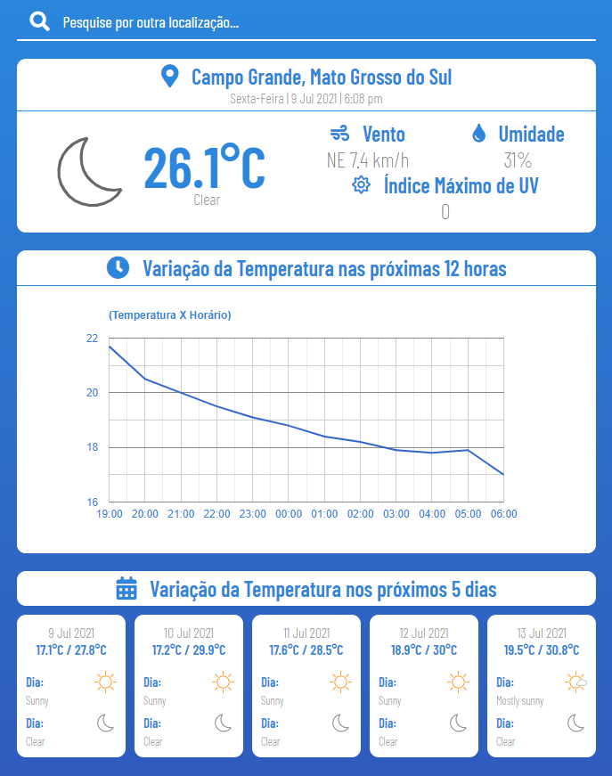

# Weather App

## Sobre

Aplicação desenvolvida para consultar as condições climáticas, implementado em Vue.JS e utiliza algumas APIs para consultar a localização e os dados do clima.

## Interface



A interface é composta por: uma barra de pesquisa que pode ser executada clicando no ícone da Lupa ou através da tecla Enter quando o input estiver ativado; um container, que indica em seu cabeçalho a localização de acesso ou localização pesquisada (Cidade, Estado. Ex: Campinas, São Paulo) além da data de acesso ou de pesquisa (Dia da semana | dia mês ano | horário Ex: Sexta-Feira | 9 jul 2021 | 4:37 pm ), no corpo há um ícone do clima, a temperatura em Celsius, uma descrição para o clima, o vento (Direção, Velocidade e Unidade) em quilômetros por hora, a umidade em porcentagem e o índice de raios ultravioleta; um container que apresenta a variação das próximas 12 horas em forma de gráfico de linha (Temperatura em Celsius por hora); um container que aponta a variação dos próximos 5 dias apresentando a data (dia mês ano. Ex: 9 jul 2021), a temperatura mínima e máxima em Celsius, a condição da noite e do dia com ícone do clima e descrição.

## Funcionalidades

A aplicação contém uma barra de pesquisa que permite a busca por locais, quando a consulta é executada (Tecla "Enter" ou Evento de "Click" na lupa), através de uma API, é feita a geocodificação direta, convertendo texto de localização em coordenadas geográficas.

## APIs Utilizadas

Foram utilizadas três APIs: 
- AccuWeather API (Consulta pelas condições climáticas - [Documentação](https://developer.accuweather.com/apis));
- Ip API (Consulta da localização através do IP - [Documentação](https://ip-api.com/docs));
- MapboxGeocoding Api (Consulta das coordenadas geográficas através da string de localização - [Documentação](https://docs.mapbox.com/api/search/geocoding/));

AccuWeather e MapboxGeocoding necessitam de chave de acesso, sendo necessário o cadastro em ambos os serviços e a criação das "keys". É possível alterar os valores das chaves nos arquivos: './src/services/AccuWeatherAPI.js' e './src/services/MapboxGeocodingAPI.js'.

## Tecnologias Utilizadas

- HTML / CSS / Javacript;
- Pré-processador SASS; 
- Vue.JS;
- Google Charts;
- Biblioteca Axios;

## Executar o projeto

### Pré-requisitos:

- npm / yarn;
- git;
- Cadastro no serviço AccuWeather e criação de uma Key;
- Cadastro no serviço MapboxGeocoding e criação de uma Key;

```bash
# Clonar repositório
git clone https://github.com/Lucas-Braga20/weather-app.git

# Acessar a pasta
cd weather-app

# Instalar as dependências (Project Setup)
npm install
```

É necessário fazer a alteração das chaves nas pastas:
- './src/services/AccuWeatherAPI.js'
- './src/services/MapboxGeocodingAPI.js'

#### Compilar para desenvolvimento
```bash
npm run serve
```

#### Compilar para produção
```bash
npm run build
```
